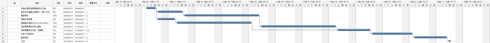
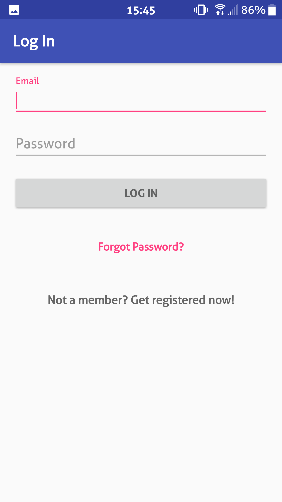
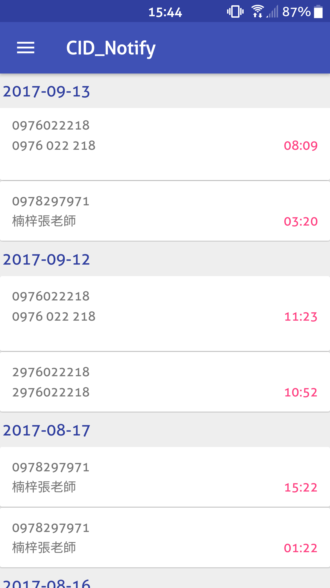

# CID_Notify 
* 組別 : 第17組
### 成員 
>* 0424035 鄧仁豐
>* 0424014 張証寓
>* 0424058 邱彥鈞
* 專題題目 : 市話CID辨識與通知
* 指導老師 : 張弘毅
---------
### 簡介
>當市話有電話進線時，透過電路辨識電話號碼(Caller ID)，再利用樹莓派查詢相關資料顯示並將資訊上傳到 FireBase Server 儲存，同步對手機進行通知。 
### 需求分析
> 功能性需求
>1. 來電辨識
 1.1 收到訊號並即時解碼
 1.2 透過 Whoscall 或 TrueCaller 查詢號碼所屬之資訊
>2. 即時通知
 2.1 將查詢之資訊顯示在Pi的螢幕上
 2.2 透過 FireBase Server 進行手機APP通知發送
>3. 資料儲存與查詢
 3.1 資料將會儲存在 FireBase 的 RealTimeDataBase 中
 3.2 可以透過APP或Web進行查詢

> 非功能性需求
>1. 效能需求
 1.1 效能必須達到一定水準，e.g.響鈴3秒內顯示
 1.2 低功耗、低發熱量
>2. 安全需求
  2.1 使用者認證，避免隱私外洩
  2.2 加密傳輸
>3. 操作需求 UI/UX
 3.1 提高使用者體驗，操作容易上手
 3.2 介面乾淨美觀，資訊清晰

  

